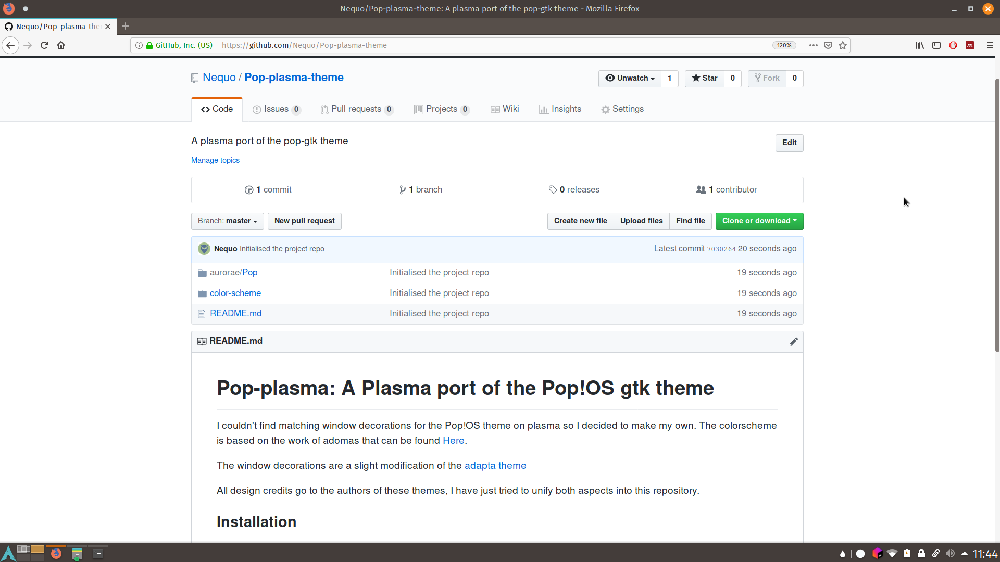
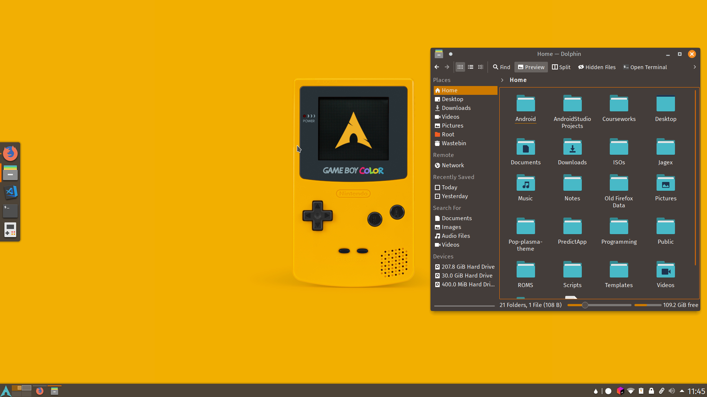

# Pop-plasma: A Plasma port of the Pop!OS gtk theme

I couldn't find matching window decorations for the Pop!OS theme on plasma so I decided to make my own. The colorscheme is based on the work of adomas that can be found [Here](https://store.kde.org/p/1202406/).

The window decorations are a slight modification of the [adapta theme](https://github.com/PapirusDevelopmentTeam/adapta-kde)

All design credits go to the authors of these themes, I have just tried to unify both aspects into this repository.

## Installation

Download the files from this repository. You can either place the files or link them using symbolic links (ln -s)

1. Place ./aurorae/Pop in ~/.local/share/aurorae/themes (create the directory if it doesn't exist)
2. Place the ./colorscheme/Pop\ Dark.colors in ~/.kde4/share/apps/color-schemes. Alternatively, you can "Install from file" from the settings' color module.
3. Finally, activate both themes by setting the colors and window decorations from your system settings.

## Suggestions

- Disable the box saying "Apply colors to non-QT applications from the color settings. This will help with menus being unreadable.
- Use along the pop-gtk-theme for a consistent look
- Use the Arc-Color desktop theme which matches plasma colors to the desktop theme. It comes installed with the arc-kde package.
